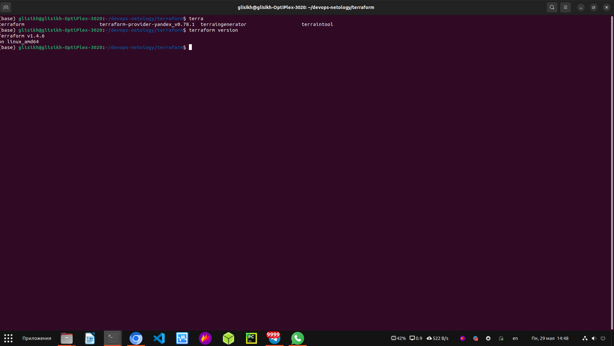
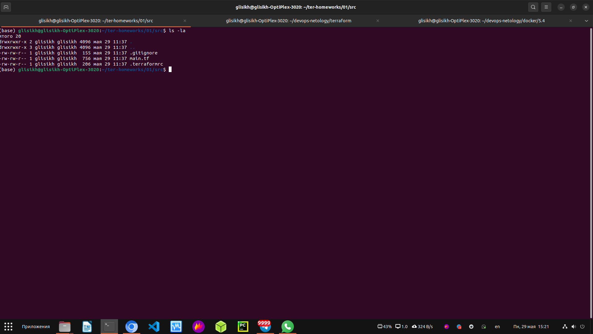
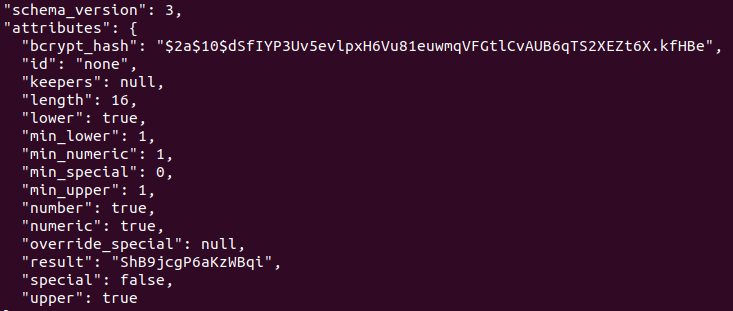
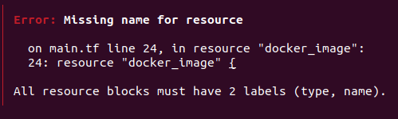
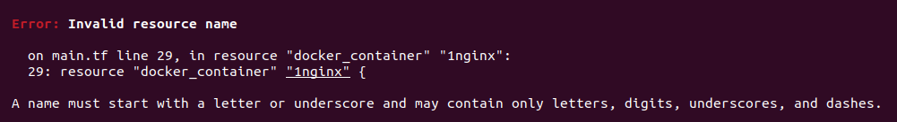
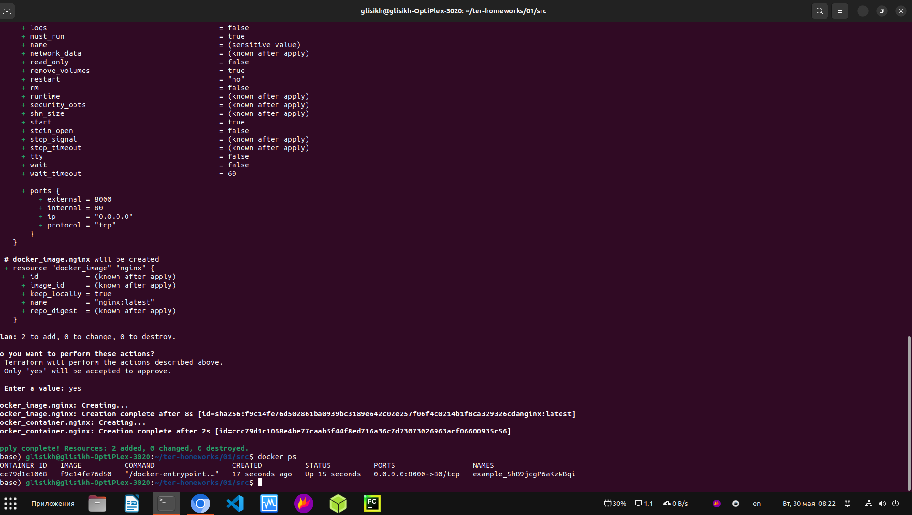
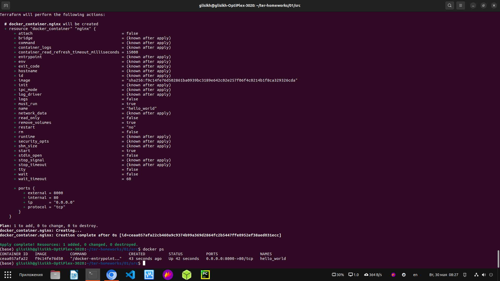
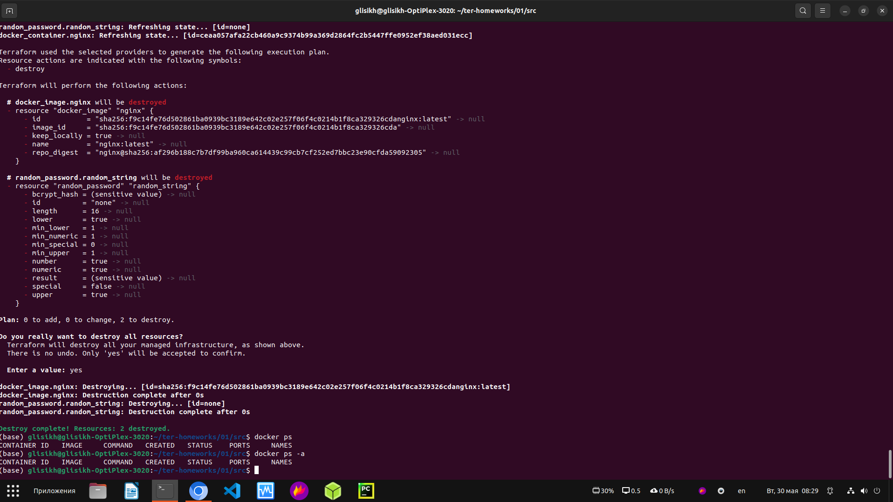
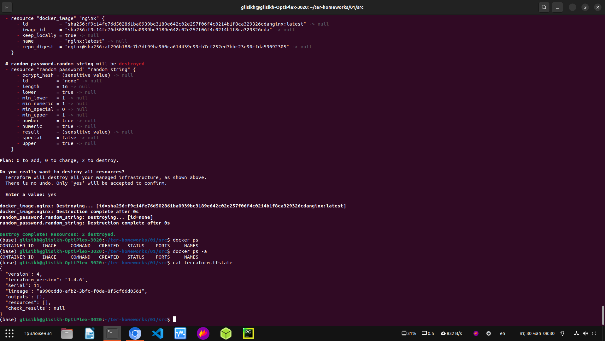

# Домашнее задание к занятию "Введение в Terraform"

---

##Версия Terraform

Скачайте и установите актуальную версию terraform >=1.4.0 . Приложите скриншот вывода команды terraform --version

<p align="center">
  
</p>


## Задача 1
1. Перейдите в каталог src. Скачайте все необходимые зависимости, использованные в проекте.

Скриншот:

<p align="center">
  
</p>

2. Изучите файл .gitignore. В каком terraform файле согласно этому .gitignore допустимо сохранить личную, секретную информацию?

Ответ: *.tfstate

3. Выполните код проекта. Найдите в State-файле секретное содержимое созданного ресурса random_password, пришлите в качестве ответа конкретный ключ и его значение.

Ответ в виде скриншота:

<p align="center">
  
</p>

4. Раскомментируйте блок кода, примерно расположенный на строчках 29-42 файла main.tf. Выполните команду terraform validate. Объясните в чем заключаются намеренно допущенные ошибки? Исправьте их.

Ответы:

<p align="center">
  
</p>

Отсутствует имя ресурса. Ошибка в том, что блок "resourse" состоит из типа объекта из классификатора provider, уникальным именем в текущем проекте и аргументами для создания ресурса

<p align="center">
  
</p>

Неверное имя ресурса. Имя должно начинаться с буквы или символа подчеркивания и может содержать только буквы, цифры, знаки подчеркивания и тире.

Ошибка из-за "random_password.random_string_fake.resuld", потому что нет такого аргумента. Вместо этого должно "random_password.random_string.result"

5. Выполните код. В качестве ответа приложите вывод команды docker ps

Скриншот:

<p align="center">
  
</p>

6. Замените имя docker-контейнера в блоке кода на hello_world, выполните команду terraform apply -auto-approve. 
Объясните своими словами, в чем может быть опасность применения ключа -auto-approve ? В качестве ответа дополнительно приложите вывод команды docker ps

При запуске terraform apply -auto-approve команда создает план на основе изменений, внесенных в инфраструктуру. 
Это делает использование этой команды очень опасным, поскольку некоторые ошибки могут привести к необратимой потере данных или уничтожению всей базы данных. 
Эти ошибки будут применены без одобрения администратора.

Скриншот:

<p align="center">
  
</p>

7. Уничтожьте созданные ресурсы с помощью terraform. Убедитесь, что все ресурсы удалены. Приложите содержимое файла terraform.tfstate.

Скриншоты:

<p align="center">
  
</p>

<p align="center">
  
</p>

8. Объясните, почему при этом не был удален docker образ nginx:latest ? Ответ подкрепите выдержкой из документации провайдера.

```sh
 "type": "docker_image",
      "name": "nginx",
      "provider": "provider[\"registry.terraform.io/kreuzwerker/docker\"]",
      "instances": [
        {
          "keep_locally": true,
        }
```

keep_locally(логическое значение) Если true, образ Docker не будет удален при операции уничтожения. 
Если это неверно, он удалит образ из локального хранилища докера при операции уничтожения.

