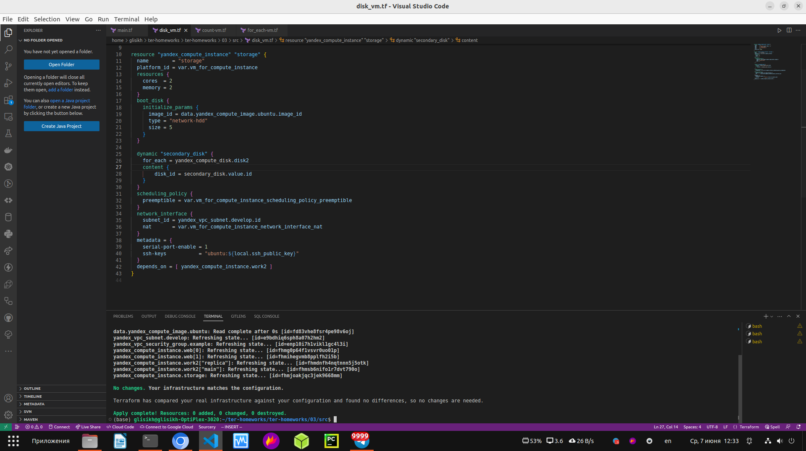

# Домашнее задание к занятию "Управляющие конструкции в коде Terraform"

### Цель задания

1. Отработать основные принципы и методы работы с управляющими конструкциями Terraform
2. Освоить работу с шаблонизатором Terraform(Interpolation Syntax)

------

### Чеклист готовности к домашнему заданию

1. Зарегистрирован аккаунт в Yandex Cloud. Использован промокод на грант.
2. Установлен инструмент yandex cli.
3. Доступен исходный код для выполнения задания в директории [**03/src**](https://github.com/netology-code/ter-homeworks/tree/main/03/src).
4. Любые ВМ, использованные при выполнении задания должны быть прерываемыми, для экономии средств.

------

### Инструменты/ дополнительные материалы, которые пригодятся для выполнения задания

1. [Консоль управления Yandex Cloud](https://console.cloud.yandex.ru/folders/<cloud_id>/vpc/security-groups).
2. [Группы безопасности](https://cloud.yandex.ru/docs/vpc/concepts/security-groups?from=int-console-help-center-or-nav).
3. [Datasource compute disk](https://terraform-eap.website.yandexcloud.net/docs/providers/yandex/d/datasource_compute_disk.html).

### Задание 1

1. Изучите проект.
2. Заполните файл personal.auto.tfvars
3. Инициализируйте проект, выполните код (он выполнится даже если доступа к preview нет).

Примечание: Если у вас не активирован preview доступ к функционалу "Группы безопасности" в Yandex Cloud - запросите доступ у поддержки облачного провайдера. Обычно его выдают в течении 24-х часов.

Приложите скриншот входящих правил "Группы безопасности" в ЛК Yandex Cloud  или скриншот отказа в предоставлении доступа к preview версии.

  

------

### Задание 2

1. Создайте файл count-vm.tf. Опишите в нем создание двух **одинаковых** ВМ  web-1 и web-2(не web-0 и web-1!), с минимальными параметрами, используя мета-аргумент **count loop**. Назначьте ВМ созданную в 1-м задании группу безопасности.

  

  

2. Создайте файл for_each-vm.tf. Опишите в нем создание 2 ВМ с именами "main" и "replica" **разных** по cpu/ram/disk , используя мета-аргумент **for_each loop**. Используйте переменную типа list(object({ vm_name=string, cpu=number, ram=number, disk=number  })). При желании внесите в переменную все возможные параметры.

  

  

  

3. ВМ из пункта 2.2 должны создаваться после создания ВМ из пункта 2.1.

Ответ: Это выполнено с помощью "depends_on"

4. Используйте функцию file в local переменной для считывания ключа ~/.ssh/id_rsa.pub и его последующего использования в блоке metadata, взятому из ДЗ №2.

  

5. Инициализируйте проект, выполните код.

------

### Задание 3

1. Создайте 3 одинаковых виртуальных диска, размером 1 Гб с помощью ресурса yandex_compute_disk и мета-аргумента count в файле **disk_vm.tf** .

  

2. Создайте в том же файле одну ВМ c именем "storage" . Используйте блок **dynamic secondary_disk{..}** и мета-аргумент for_each для подключения созданных вами дополнительных дисков.

  

  

  

------

### Задание 4

1. В файле ansible.tf создайте inventory-файл для ansible.
Используйте функцию tepmplatefile и файл-шаблон для создания ansible inventory-файла из лекции.
Готовый код возьмите из демонстрации к лекции [**demonstration2**](https://github.com/netology-code/ter-homeworks/tree/main/demonstration2).
Передайте в него в качестве переменных группы виртуальных машин из задания 2.1, 2.2 и 3.2.(т.е. 5 ВМ)

  

2. Инвентарь должен содержать 3 группы [webservers], [databases], [storage] и быть динамическим, т.е. обработать как группу из 2-х ВМ так и 999 ВМ.
4. Выполните код. Приложите скриншот получившегося файла. 

  

  

 
