# Домашнее задание к занятию "Продвинутые методы работы с Terraform"

### Цель задания

1. Научиться использовать модули.
2. Отработать операции state.
3. Закрепить пройденный материал.


### Чеклист готовности к домашнему заданию

1. Зарегистрирован аккаунт в Yandex Cloud. Использован промокод на грант.
2. Установлен инструмент yandex CLI
3. Исходный код для выполнения задания расположен в директории [**04/src**](https://github.com/netology-code/ter-homeworks/tree/main/04/src).
4. Любые ВМ, использованные при выполнении задания должны быть прерываемыми, для экономии средств.

------

### Задание 1

1. Возьмите из [демонстрации к лекции готовый код](https://github.com/netology-code/ter-homeworks/tree/main/04/demonstration1) для создания ВМ с помощью remote модуля.
2. Создайте 1 ВМ, используя данный модуль. В файле cloud-init.yml необходимо использовать переменную для ssh ключа вместо хардкода. Передайте ssh-ключ в функцию template_file в блоке vars ={} .
Воспользуйтесь [**примером**](https://grantorchard.com/dynamic-cloudinit-content-with-terraform-file-templates/). Обратите внимание что ssh-authorized-keys принимает в себя список, а не строку!
3. Добавьте в файл cloud-init.yml установку nginx.
4. Предоставьте скриншот подключения к консоли и вывод команды ```sudo nginx -t```.

Скриншоты:

<p align="center">
  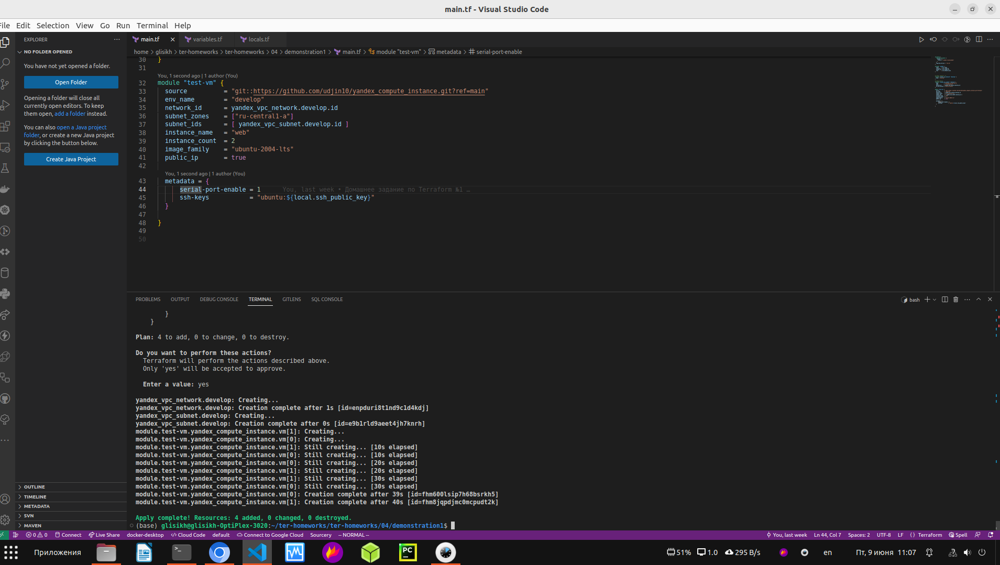
</p>

<p align="center">
  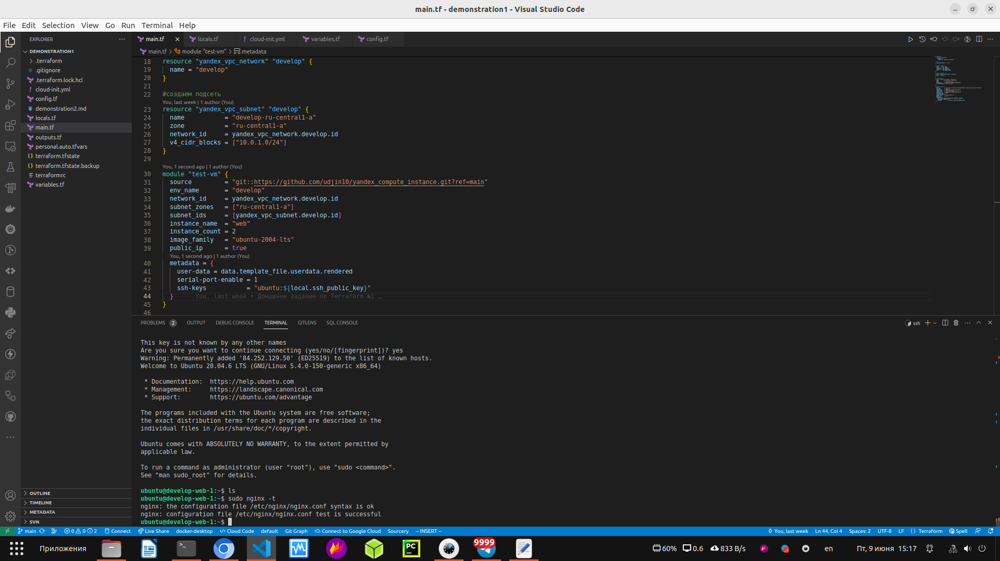
</p>

<p align="center">
  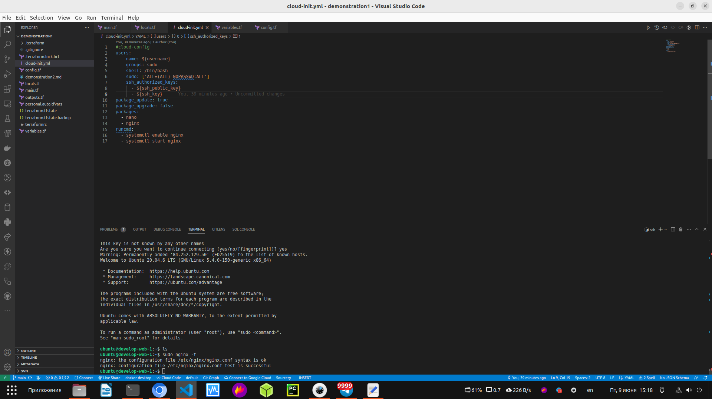
</p>

<p align="center">
  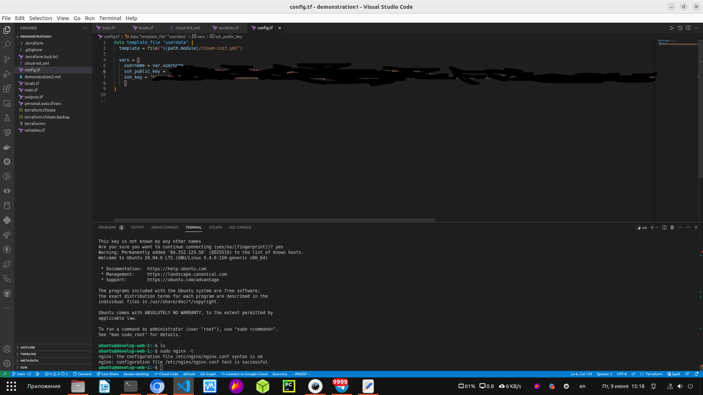
</p>

<p align="center">
  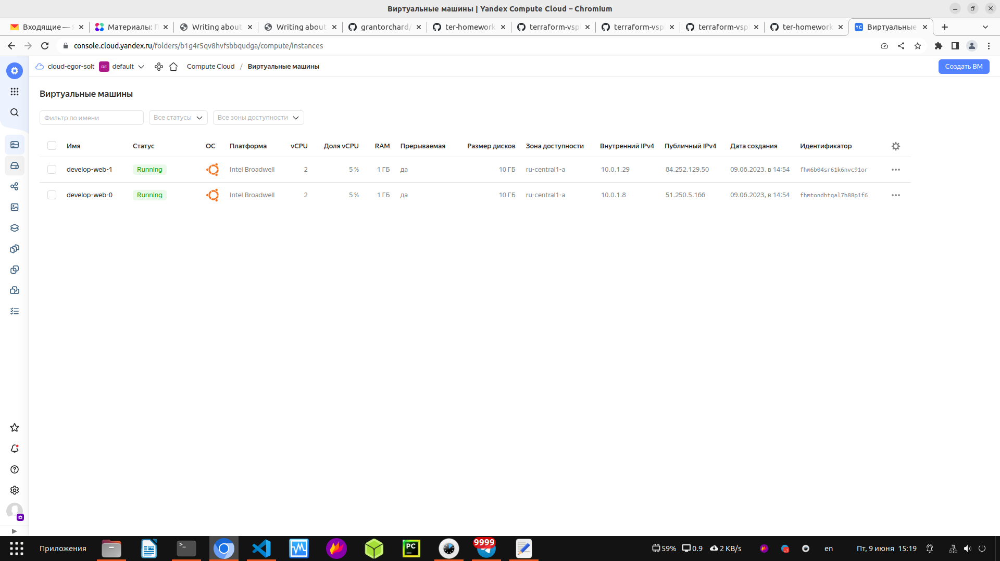
</p>

<p align="center">
  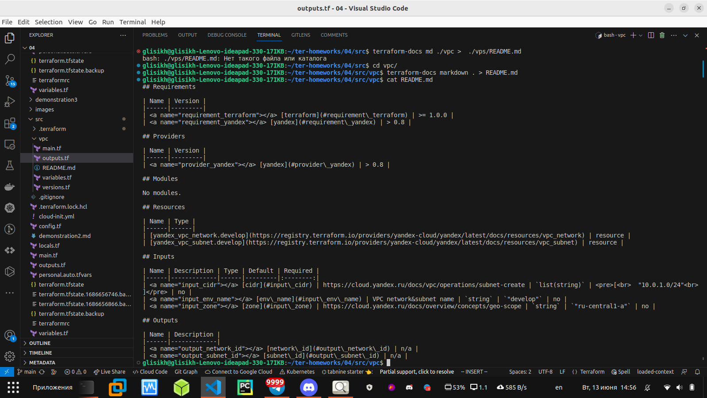
</p>


------

### Задание 2

1. Напишите локальный модуль vpc, который будет создавать 2 ресурса: **одну** сеть и **одну** подсеть в зоне, объявленной при вызове модуля. например: ```ru-central1-a```.
2. Модуль должен возвращать значения vpc.id и subnet.id
3. Замените ресурсы yandex_vpc_network и yandex_vpc_subnet, созданным модулем.
4. Сгенерируйте документацию к модулю с помощью terraform-docs.    
 
Пример вызова:
```
module "vpc_dev" {
  source       = "./vpc"
  env_name     = "develop"
  zone = "ru-central1-a"
  cidr = "10.0.1.0/24"
}
```

Скриншоты:

<p align="center">
  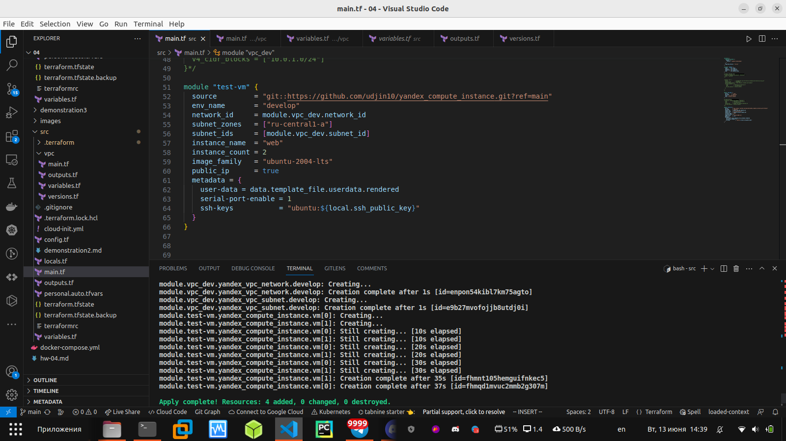
</p>

<p align="center">
  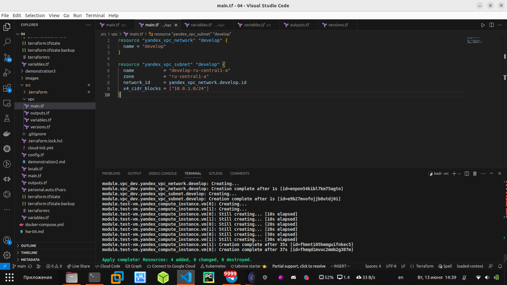
</p>

<p align="center">
  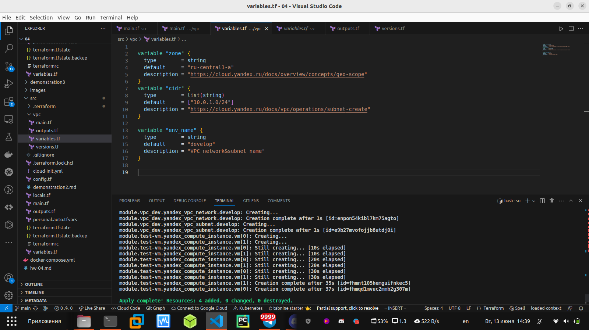
</p>

<p align="center">
  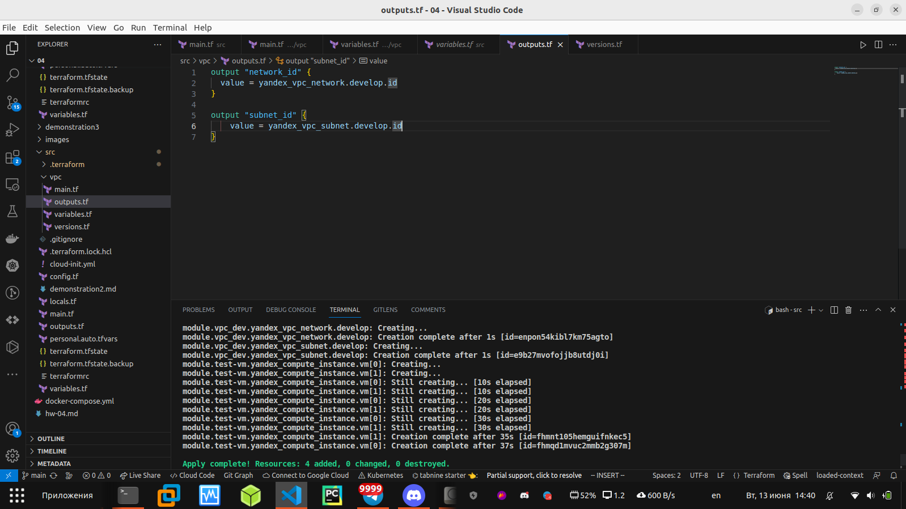
</p>

<p align="center">
  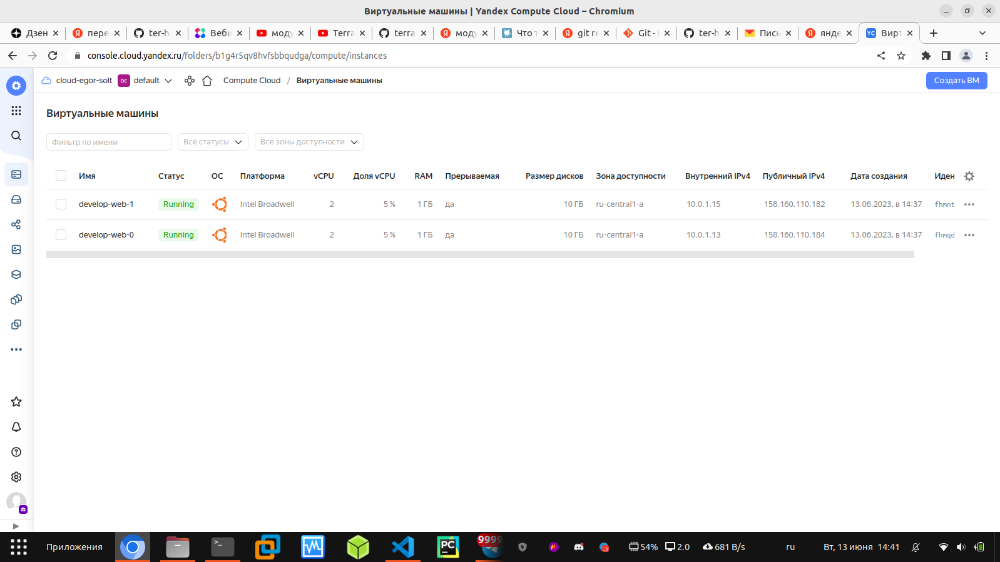
</p>


### Задание 3
1. Выведите список ресурсов в стейте.
2. Удалите из стейта модуль vpc.
3. Импортируйте его обратно. Проверьте terraform plan - изменений быть не должно.
Приложите список выполненных команд и вывод.

<p align="center">
  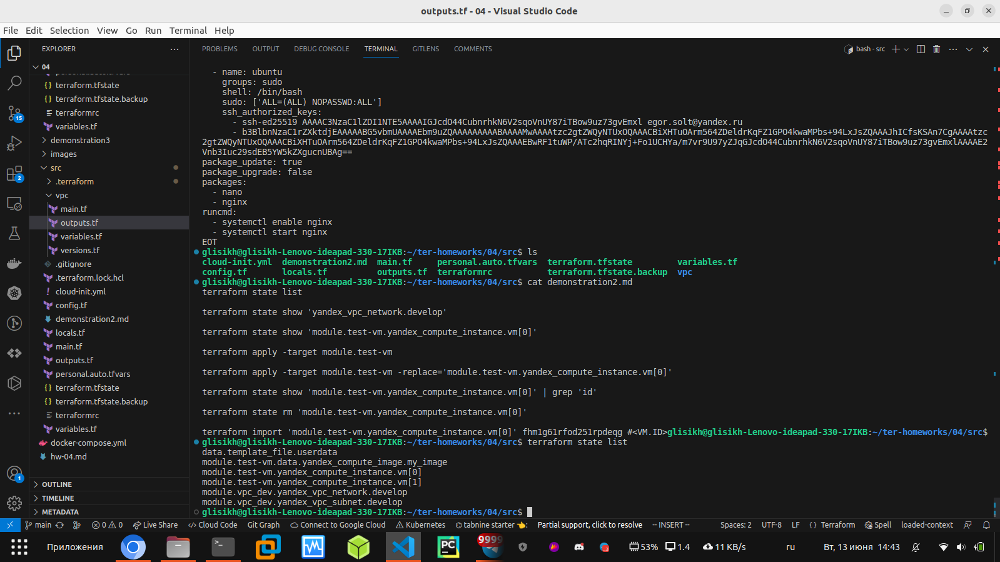
</p>

<p align="center">
  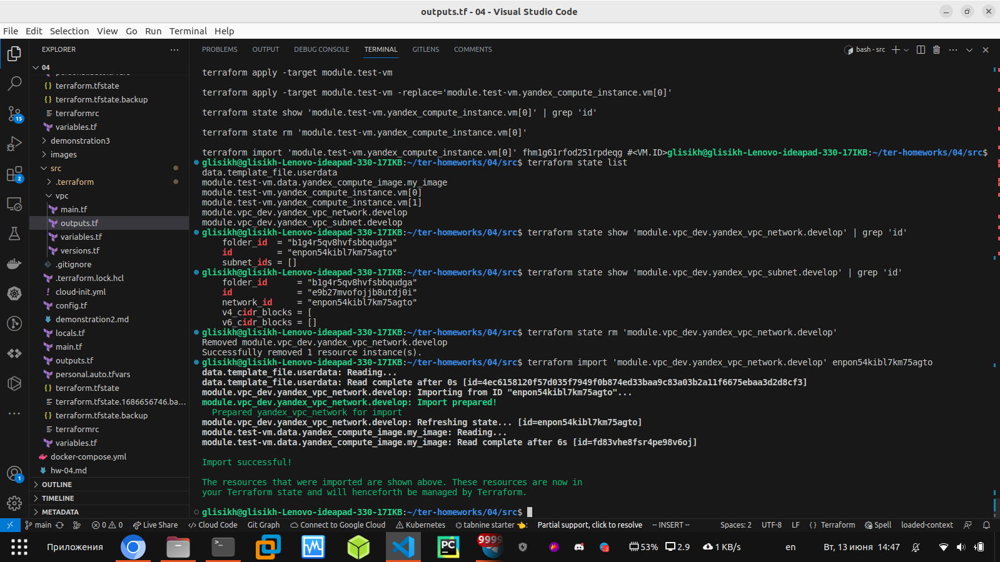
</p>

<p align="center">
  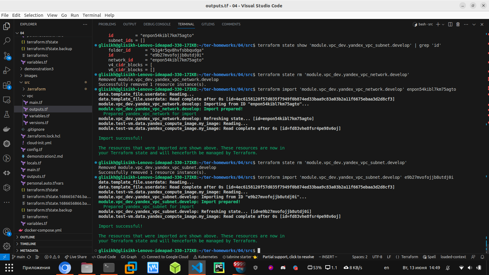
</p>
